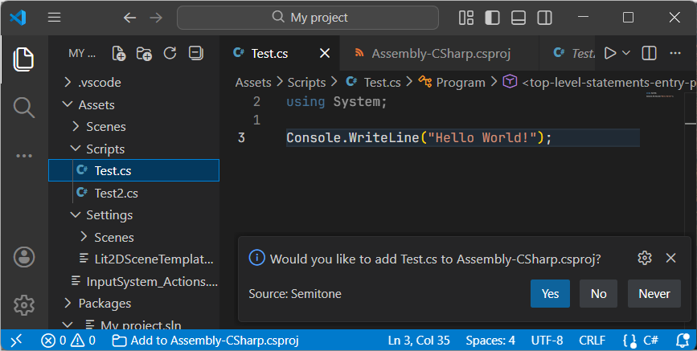

# Semitone

Keep your `.csproj` synchronized with new files. Handy for teams who use VS Code and Visual Studio, or if you don't want to wait for Unity domain reloads to add files to the project!

## Migrating from [vscode-csproj]

To preserve compatibility, settings are still prefixed with `csproj`. The `silentDeletion` setting has been replaced with `autoRemove` - refer to [Extension Settings](#extension-settings).

## Demo

### Adding Files to a Project

### Removing Files from a Project

| **Single File Deletion**  | **Multiple File Deletion**
|---------------------------|--------------------------------
|  | 

## How it Works

When you switch to or save a file not in a matching project specified by `projectFiles`, you will prompted.

Choosing "Close" will add an item to the status bar and stop asking you while you have the file open.

| **File not in project** | **File contained in project**
|------------------------|------------------------------
|  | 

You can add a file to the project via the command palette:

Or via the context menu in the file explorer:

## Extension Settings

This extension contributes the following settings:

| **Setting Key**         | **Description**
|-------------------------|-----------------
| `csproj.enable`         | Enable or disable this extension.
| `csproj.projectFiles`   | Lists projects to use for specific files or directories.
| `csproj.itemType`       | Maps file extensions to item types. Defaults to   `{ "*": "Content", ".cs": "Compile", ".ts": "TypeScriptCompile" }`
| `csproj.includeRegex`   | Regular expression to match files you want to add to the project. Defaults to `.*`.
| `csproj.excludeRegex`   | Regular expression to exclude files you do not want to add to the project. Defaults to `(\\.csproj\|\\.sln\|\\.slnx)$`.
| `csproj.autoAdd`        | Enable, disable, or prompt for adding items when new files are opened or saved. Defaults to `prompt`.
| `csproj.autoRemove`     | Enable, disable, or prompt for removing items when their corresponding files are deleted. Defaults to `prompt`.

These regular expressions will prevent unwanted prompts. If a file matches `includeRegex` *and* `excludeRegex`, it will be excluded.

`autoAdd`, `autoRemove`, `includeRegex`, and `excludeRegex` do not apply when using commands directly via the Command Palette or a context menu. However, using "csproj: Include in project" on a directory will honor `includeRegex` and `excludeRegex` for the files within.

## Links

* [GitHub Repository](https://github.com/ongyx/semitone)
* [Marketplace Entry](https://marketplace.visualstudio.com/items?itemName=ongyx.semitone)

## Release Notes

Please refer to Github for the [full release history](https://github.com/ongyx/semitone/releases).

### 0.1.0

Initial fork from [vscode-csproj].

## License

MIT.

[vscode-csproj]: https://github.com/azz/vscode-csproj