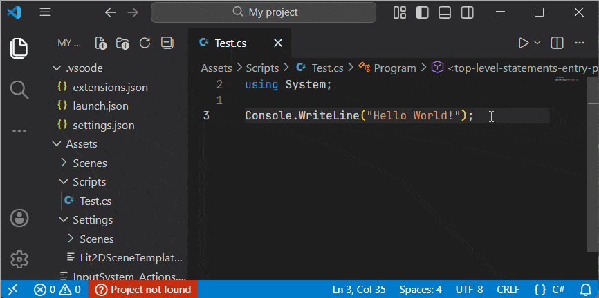
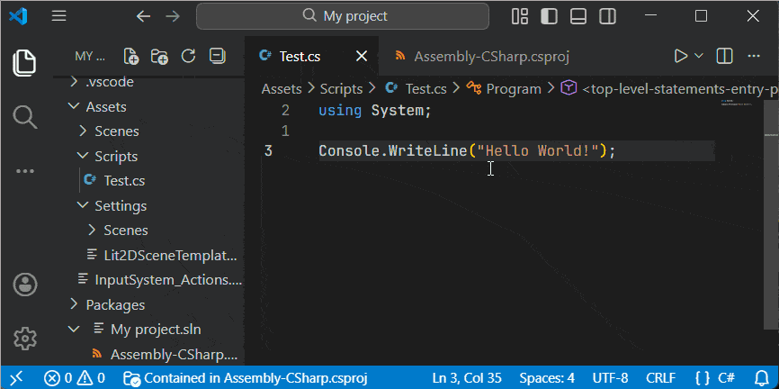
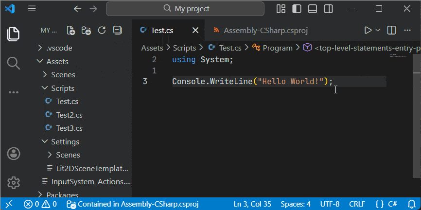

# Semitone

[][marketplace]
[][open-vsx]

Keep your `.csproj` synchronized with new files. Handy for teams who use VS Code and Visual Studio, or if you don't want to wait for Unity domain reloads to add files to the project!

## Migrating from [vscode-csproj]

To preserve compatibility, settings are still prefixed with `csproj`. The `silentDeletion` setting has been replaced with `autoRemove` - refer to [Settings](#settings).

## Usage

Once you've added at least one project using the `csproj: Configure projects` command or configured the `csproj.projectFiles` setting, the extension will start syncing your files.
Projects can be configured globally, per workspace, or per workspace folder.

## Demo

| Adding files          | Removing files           |
| --------------------- | ------------------------ |
|  |  |

## How it Works

When switching to or saving a file that matches a project specified in `csproj.projectFiles`, the extension will ask if you want to add the file to that project.
Selecting "No" will not prompt again while the file is open, and selecting "Never" will add the file to the ignore list.

An open file has one of the following statuses:

| In project                                                            | Not in project                                                            | Ignored                                                                           | Project Not Found                                                            |
| --------------------------------------------------------------------- | ------------------------------------------------------------------------- | --------------------------------------------------------------------------------- | ---------------------------------------------------------------------------- |
|  The file is contained in a project. |  The file can be added to a project. |  The file is ignored by user or workspace settings. |  No project was found for this file. |

## Settings

This extension contributes the following settings:

| Setting               | Type                                                         | Default Value                                                      | Description                                                                               |
| --------------------- | ------------------------------------------------------------ | ------------------------------------------------------------------ | ----------------------------------------------------------------------------------------- |
| `csproj.projectFiles` | `[ { path: "/path/to/project.csproj", glob: "glob" }, ... ]` | `[]`                                                               | List of projects to use for specific globs.                                               |
| `csproj.itemType`     | `{ "glob": "itemType" }`                                     | `{ "*": "Content", ".cs": "Compile", ".ts": "TypeScriptCompile" }` | Map of file extensions/globs to item types.                                               |
| `csproj.includeRegex` | RegExp                                                       | `.*`                                                               | Regular expression for including files into projects.                                     |
| `csproj.excludeRegex` | RegExp                                                       | `(\\.csproj\|\\.sln\|\\.slnx)$`                                    | Regular expression for excluding files from projects.                                     |
| `csproj.autoAdd`      | `on`, `prompt`, `off`                                        | `prompt`                                                           | Enable, disable, or prompt for adding items when new files are opened or saved.           |
| `csproj.autoRemove`   | `on`, `prompt`, `off`                                        | `prompt`                                                           | Enable, disable, or prompt for removing items when their corresponding files are deleted. |

Please refer to [minimatch] for supported glob syntax.

Files which do not match `csproj.includeRegex` or match `csproj.excludeRegex` will not be added automatically.
These settings, along with `csproj.autoAdd` and `csproj.autoRemove`, do not affect running commands via the Command Palette or a context menu, unless the `csproj: Include in project` comamnd is used on a folder.

## Links

* [Github Repository](github)
* [Visual Studio Marketplace](marketplace)
* [Open VSX Registry](open-vsx)

## Release Notes

Please refer to Github for the [full release history](https://github.com/ongyx/semitone/releases).

### 0.1.1

Fixed cache-related bugs and updated README/LICENSE.

### 0.1.0

Initial fork from [vscode-csproj].

## License

MIT.

[vscode-csproj]: https://github.com/azz/vscode-csproj
[github]: https://github.com/ongyx/semitone
[marketplace]: https://marketplace.visualstudio.com/items?itemName=ongyx.semitone
[open-vsx]: https://open-vsx.org/extension/ongyx/semitone
[minimatch]: https://github.com/isaacs/minimatch?tab=readme-ov-file#features